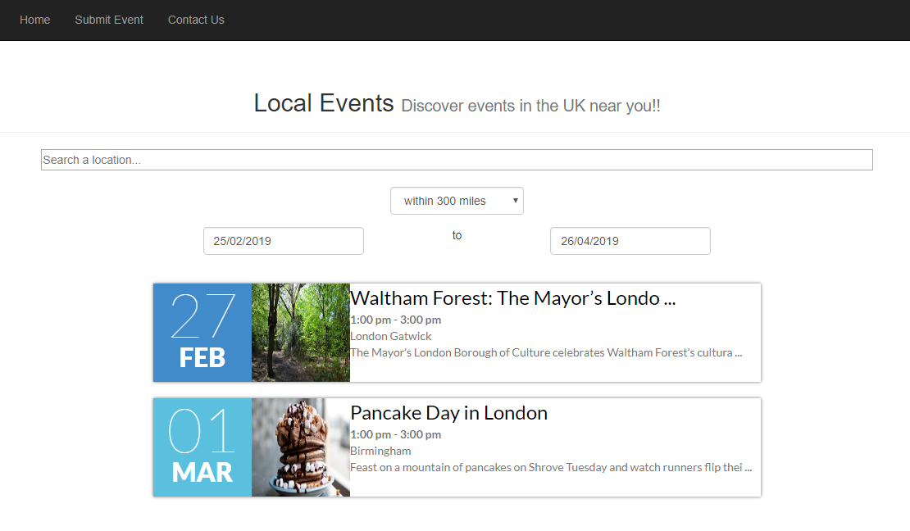
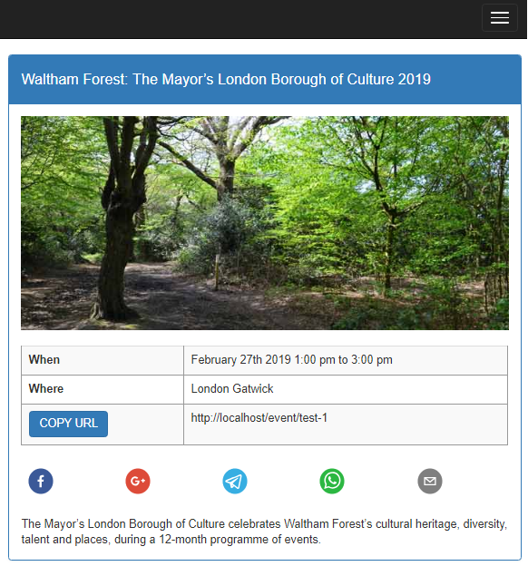

## About

This application is used to view any submit events happening near you.

This is a PoC  to demonstrate the following technologies working
together:
* Spring Boot
* ReactJS + Redux
* MongoDB
* Bootstrap
* Google Location API
* reCAPTCHA

## Setup

### MongoDB

A local mongoDB should be setup. Once setup, please configure the 
credentials in the application.properties files.

NOTE: After adding events, they must fulfil the criteria set by the front end filters
(i.e. location radius, start date, end date) to appear on the UI. 
Events must also have the "approved" property set to true before appearing on the UI.
This can be done via the admin panel.

### Mock Data

Currently the app is mocking data to demonstrate functionality
without the DB setup. The mock data is initialised in js/actions/index.js

Mock data will appear if communication with the DB fails.
Uncomment these lines if you have the DB up and running.

**NOTE: Date/Location filters will NOT work if you are only using mock data.** 

## To run the application:

1. npm install
2. mvn spring-boot:run
3. To watch for react changes run: npm run-script watch
4. Navigate to localhost:8080

## Other Notes

### Admin Panel
An admin panel exists so you can submit events to the website for testing.

Please ensure the DB is running before adding events.

You can login at localhost:8080/login

The username/password can be found in Constants.java and these values are automatically
added to the DB on first startup.

Once you are logged in you can view the admin panel at localhost:8080/adminpanel, which
will provide an interface to add events (via the form or JSON), view the history of events,
view messages etc.

### reCAPTCHA
reCAPTCHA is implemented on the Contact us and Admin panel login
page. 

The code for reCAPTCHA on the front end is currently commented out on login_form.js.

The code for reCAPTCHA on the back end is currently commented out in CustomAuthenticationFilter.java

### Google Places API
place_search.js uses the Google Maps API to find locations near you.
If you wish to have location autocomplete, you will need to uncomment the scriptLoader 
line at the bottom of the file and replace the URL with your googleapis.com/map/api key

### TODO

* Replace HTTP request library with axios completely
* Refactor remaining of app using redux

## Screenshots

#### Home page

#### Specific Event page
